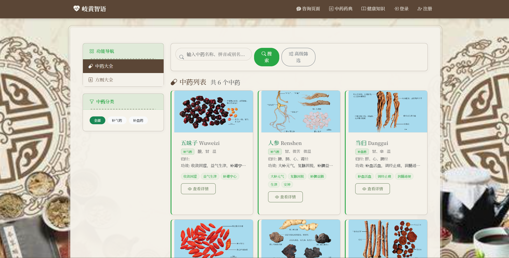

# 多模态岐黄智语

一个基于Flask的智能聊天应用，集成了DeepSeek AI模型和EasyOCR图像识别功能，支持多模态交互，专注于中医健康咨询。

## 功能特点

- **智能对话**：基于DeepSeek AI模型的自然语言处理能力
- **中医知识**：内置中医理论和实践知识库
- **多模态输入**：支持文本、图片、文档等多种输入方式
- **图像识别**：使用EasyOCR进行图像文字识别，提取图片中的文本内容
- **文件处理**：支持上传和处理多种文件格式（TXT、PDF、DOC、DOCX、图片等）
- **音频转写**：支持音频文件的内容转写
- **知识文章**：提供丰富的中医健康文章，支持评论、点赞、收藏功能
- **中药大全**：提供中药信息查询，每页显示6个中药信息
- **方剂大全**：提供方剂信息查询，每页显示4个方剂信息
- **实时响应**：流式响应，即时显示AI回复
- **会话历史**：保存对话历史，支持上下文理解
- **美观界面**：现代化的用户界面设计，支持暗色主题

## 技术栈

- **后端**：Python、Flask
- **前端**：HTML、CSS、JavaScript
- **AI模型**：DeepSeek API
- **图像识别**：EasyOCR
- **数据存储**：SQLite

## 已修复的问题

### 前端问题
- **highlight.min.js错误**：修复了咨询页面中`Uncaught ReferenceError: require is not defined`错误。问题原因是在浏览器环境中使用了Node.js版本的highlight.js库。已将引用改为浏览器专用版本：`https://cdn.jsdelivr.net/gh/highlightjs/cdn-release@10.7.2/build/highlight.min.js`

### 后端问题
- **Response未定义错误**：修复了聊天接口`/chat`路由中的`name 'Response' is not defined`错误。问题原因是没有从Flask导入Response类。已在app.py文件头部添加Response导入。

## 安装步骤

### 前提条件

- Python 3.8+
- pip（Python包管理器）
- Git

### 安装过程

1. **克隆仓库**

```bash
git clone https://github.com/你的用户名/tcm-assistant.git
cd tcm-assistant
```

2. **创建并激活虚拟环境**

```bash
# Windows
python -m venv venv
venv\Scripts\activate

# Linux/Mac
python3 -m venv venv
source venv/bin/activate
```

3. **安装依赖**

```bash
pip install -r requirements.txt
```

4. **配置环境变量**

创建`.env`文件，添加以下内容：

```
DEEPSEEK_API_KEY=your_deepseek_api_key
```

5. **创建上传目录**

```bash
mkdir -p static/uploads
```

6. **初始化数据库**

```bash
python init_db.py
```

7. **运行应用**

```bash
python run.py
```

## 使用方法

1. **启动应用**：运行应用后，在浏览器中访问 `http://localhost:5000`

2. **聊天功能**：
   - 在输入框中输入健康问题或中医相关咨询
   - 点击发送按钮或按Enter键发送消息
   - AI将实时生成并显示回复
   - 

3. **中药大全**：
   - 访问 `/herbs/herbs` 浏览中药信息
   - 每页显示6个中药
   - 支持按名称搜索和分类筛选
   -  
4. **方剂大全**：
   - 访问 `/herbs/formulas` 浏览方剂信息
   - 每页显示4个方剂
   - 支持按名称搜索和分类筛选
   -  

5. **健康文章**：
   - 访问 `/article/list` 浏览健康文章
   - 每页显示4篇文章
   - 支持评论、点赞、收藏功能
   -  

6. **视频教程**：
   - 访问 `/knowledge/video_tutorials` 浏览视频教程
   - 每页显示3个视频
   - 支持按分类筛选
   -  
7. **管理系统**：
   -  

## 项目结构

```
tcm-assistant/
├── app.py                # 主应用入口
├── run.py               # 运行脚本
├── config.py            # 配置文件
├── models.py            # 数据模型
├── herb_routes.py       # 中药和方剂路由
├── article_routes.py    # 文章路由
├── knowledge_routes.py  # 知识库路由
├── admin_routes.py      # 管理员路由
├── auth_routes.py       # 认证路由
├── static/              # 静态资源目录
├── templates/           # HTML模板目录
└── requirements.txt     # 依赖列表
```

## 贡献指南

欢迎对本项目进行贡献！如果您发现了问题或有改进建议，请创建Issue或提交Pull Request。

## 许可证

本项目采用 MIT 许可证。详情请参阅 LICENSE 文件。
